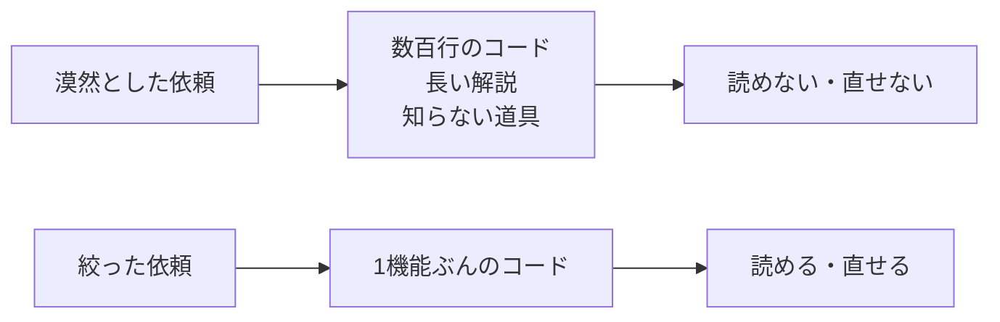
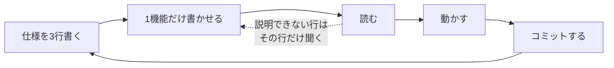
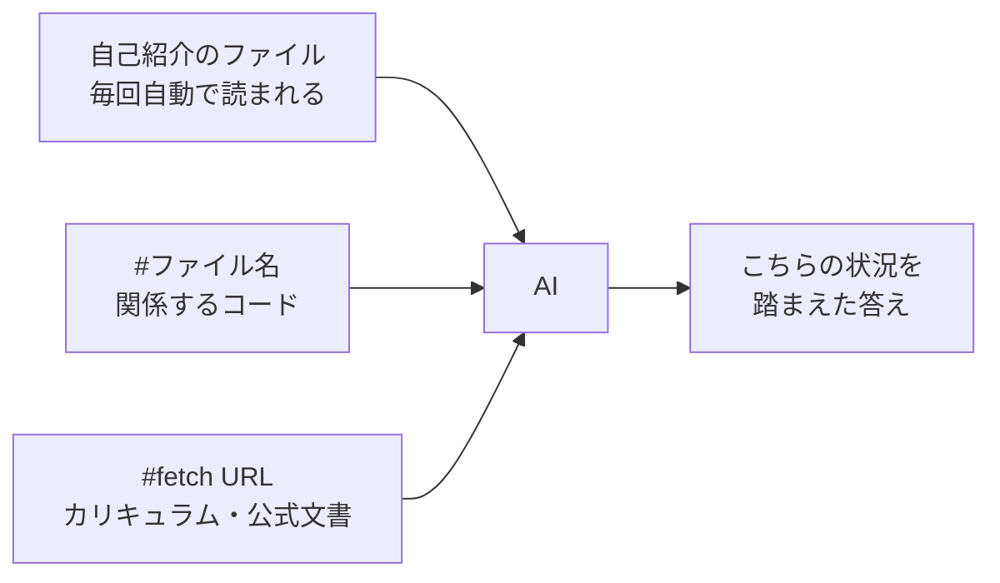
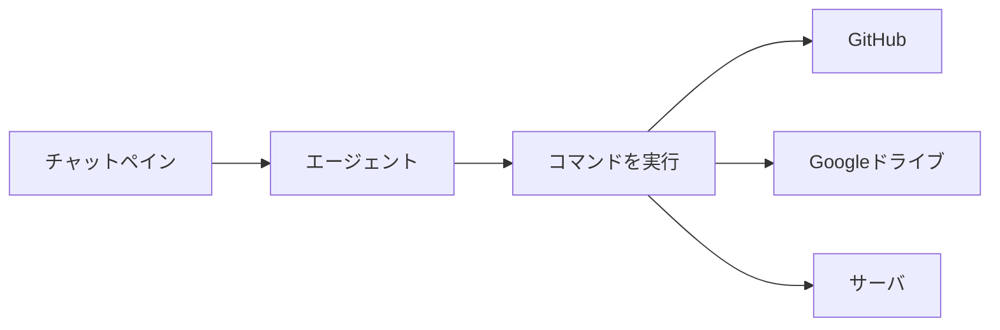

# AIを活用した開発（バイブコーディング）

近年は、AI（生成AI）に作りたいものを自然言語で伝え、コードを書いてもらう開発スタイルが広まっています。これはバイブコーディング（vibe coding）と呼ばれ、2025年に広まった言葉です。

## 主なツール

- GitHub Copilot — VSCodeに組み込んで使えるAIコーディング補助。書いている途中のコードを提案してくれます。GitHubアカウントでサインインすれば無料で使えます（補完・チャットに月ごとの上限があり、超えると翌月まで待つことになります）。なお、学生は GitHub Student Developer Pack の学生認証を通すと、上位版の Copilot Pro を無料で使えます。
- Cursor — AIを前提に作られたエディタ（VSCodeベース）。プロジェクト全体を理解して、コードの生成や修正ができます。
- Claude / ChatGPT など — チャットで相談しながらコードを書いてもらいます。

## 頼み方でスコープを絞る

うまくいかない最大の原因は、頼み方が漠然としていることです。予算で店を探すサイトを作って、とだけ頼むと、AIは数百行のコードと長い解説を一度に返してきます。しかも、自分が見たこともない道具で書かれていることがあります。動いても読めず、直せません。



絞るときは、まず自分が何を使えるかを伝えます。

漠然とした頼み方

```
予算で店を探せるサイトを作ってください。
```

絞った頼み方

```
予算で店を探せるサイトを作りたいです。

使える道具
- Python は授業で習いました
- Gradio というツールでUIが作れると聞きました
- データベースは触ったことがありません

作りたい機能
- 予算を入力すると、その予算以下の店が一覧で表示される
- 店の名前と予算が分かればよい

この条件で作れますか。作れるなら、まず一番小さい形で作ってください。
```

伝える順番が大事です。

1. 自分が使える道具を伝える — これを言わないと、AIは知らないフレームワークを持ち出してきます。動いても読めなければ、発表で説明できません。習った言語、聞いたことがあるツール、触ったことがないものを、そのまま書きます
2. 機能要件を伝える — 何ができればよいかを箇条書きにします。ここに挙げなかったものは作られません
3. 一番小さい形から頼む — 最初から全部を作らせないようにします

会話は続けられるので、動いたら次に店の詳細画面を足してください、と1機能ずつ広げていきます。

返ってくる説明が長すぎるときは、説明は不要です、コードだけ出してください、と伝えると量が減ります。

## 進め方



1. 何を作るかを、先に日本語で3行書きます。ここは自分で考える部分です
2. その3行を渡して、1つの機能だけ書かせます
3. 出てきたコードを読みます。説明できない行があれば、その行だけを指定して聞きます
4. 動かします。エラーが出たら、自分でエラーを読んでから、どの行で、何をしたら、何が出たかを伝えて直してもらいます
5. 動いたらコミットします。次の機能に進みます

## コンテキストを渡す

前の節で、使える道具や機能要件を文章で伝えました。これを毎回書くのは手間ですし、書き忘れも出ます。

AIに渡す情報をそろえる作業は、コンテキストエンジニアリングと呼ばれます。気の利いた言い回しを考えることではなく、判断に必要な材料を渡すことが中心です。



### ファイルを渡す

VS Code の Copilot では、チャット欄で `#` を打つとファイルを指定できます。

| 書き方 | 意味 |
| --- | --- |
| `#search.php` | そのファイルの中身を渡す |
| `#search.php #db.php` | 関係するファイルだけを渡す |
| `#fetch https://...` | そのページを読ませる |

ファイルをチャット欄にドラッグしても同じことができます。

コードの話をするときは、説明するより渡す方が速く、正確です。

```
#search.php 予算の上限で絞り込む条件を追加してください。
```

`#fetch` は、ページを読ませてから答えさせるときに使います。

資料を渡すと、それをもとにした答えが返ってきます。たとえば学科のカリキュラムを渡すと、自分のスキルセットを書き出させることができます。カリキュラムは次のPDFに載っています。

[令和8年度 学科ガイド（夜間部）](https://www.jec.ac.jp/wp-content/uploads/2026/04/07092232/course-guide-night2026-2.pdf)

ダウンロードしたPDFをチャット欄にドラッグして、次のように頼みます。

```
これは私の学科のカリキュラムです。
11〜14ページのネットワークセキュリティ科の必修科目をもとに、私が使えるはずの技術をスキルセットとして箇条書きにしてください。
資料に書かれていない具体的な言語やソフトウェアの名前は推測せず、最後に質問として並べてください。
```

### 自己紹介を用意しておく

使える道具や作っているものは、毎回同じです。ファイルに書いておけば、Copilot が自動で読みます。プロジェクトの直下に `.github/copilot-instructions.md` を作ってください。

```markdown
# このプロジェクトについて

## 私が使えるもの
- Python は授業で習いました
- HTML と CSS は少し書けます
- VS Code と Git は使えます
- Gradio は触ったことがあります

## 触ったことがないもの
- データベース
- Docker
- JavaScript のフレームワーク

## 作っているもの
- 予算を入力すると、その予算以下の店が一覧で表示されるWebサイト
- Google Colab 上で動かし、cloudflared で公開します

## お願いするときの約束
- 一度に1つの機能だけ書いてください
- 私が触ったことがないものを使うときは、先に理由を教えてください
- 説明は短くして、コードを優先してください
```

自分の状況に合わせて書き換えてください。触ったことがないものを正直に書くのが大事です。書いておけば、AIはそれを避けた作り方を選びます。

「私が使えるもの」は手で書かなくてかまいません。前の節で作らせたスキルセットを貼り付けます。授業の外で覚えたこと（Gradio など）は、そのあと自分で書き足します。

この内容は制作が進むにつれて変わります。データベースを使えるようになったら、その行を移します。

## コマンドとコードで操作する

繰り返す作業は、画面をクリックするのではなく、チャットペインから動かします。1回だけの作業は画面を操作した方が速いので、繰り返すものだけコードにします。

エージェントに頼めば、ターミナルのコマンドを実行します。先頭に `!` を付けると、コマンドを直接実行できます。どの道具を使うかはエージェントが選びます。



ただし、認証が必要な道具は、最初に自分で通しておきます。

### Googleドライブを操作する

Googleドライブを操作するには `rclone` を使います。

```powershell
winget install Rclone.Rclone
rclone config
```

対話形式で聞かれるので、次のように答えます。

| 質問 | 答え |
| --- | --- |
| 新しい接続を作るか | `n`（new） |
| 名前 | `gdrive` など好きな名前 |
| 種類 | `drive`（Google Drive） |
| client_id / client_secret | 空のままEnter |
| scope | `1`（フルアクセス） |
| 残りの質問 | Enterで既定のまま |

最後にブラウザが開くので、自分のGoogleアカウントで許可します。以降は認証なしで使えます。

使い方の例です。

```powershell
rclone ls gdrive:                              # ファイルの一覧
rclone copy 計画書.docx gdrive:                 # アップロード
rclone copy gdrive:週次報告書（回答）.xlsx .      # ダウンロード
rclone cat gdrive:メモ.txt                      # 中身を表示
```

`.txt` や `.docx` をアップロードするとき、次を付けるとGoogleドキュメントに変換されます。

```powershell
rclone copy 計画書.txt gdrive: --drive-import-formats txt --drive-export-formats txt
```

使い終わったら接続を解除します。学校のPCは共用で、許可した情報は `%APPDATA%\rclone\rclone.conf` に残ります。そのままにすると、次に使う人が自分のGoogleドライブを操作できてしまいます。

```powershell
rclone config disconnect gdrive:    # Google側の許可を取り消す
rclone config delete gdrive         # 設定そのものを消す
```

自分のPCなら、残しておいて構いません。

段落や表を細かく編集したい場合は、Apps Script を使います。Googleのサーバー上で動くJavaScriptで、`DocumentApp` から見出しや表を操作できます。

## 使うときの注意

AIが書いたコードは、まだ検証していない下書きです。

- 説明できないコードは残さない。理解して残すか、消すかのどちらかにします
- 過剰な防御は削る。頼まなくても入力検証や例外処理を厚く付けてくるので、読めない量に膨らみます
- 動かして確かめる。見た目が動いていても、不具合や穴があることがあります

研究発表では、どこを自分で直したかを説明してもらいます。
