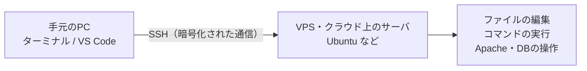
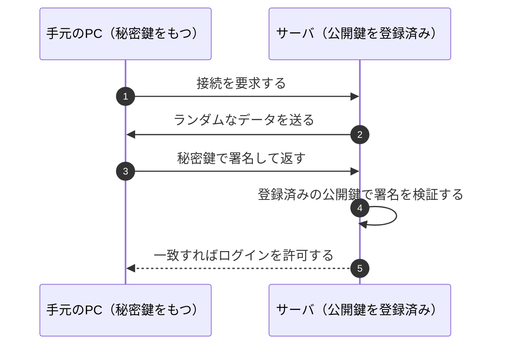
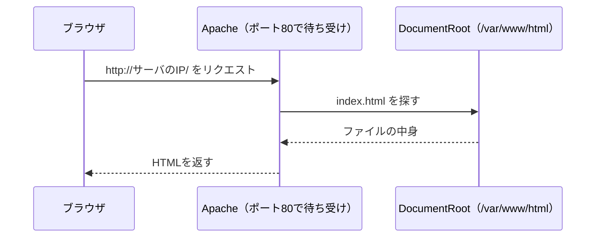
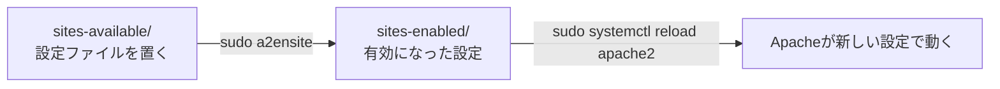
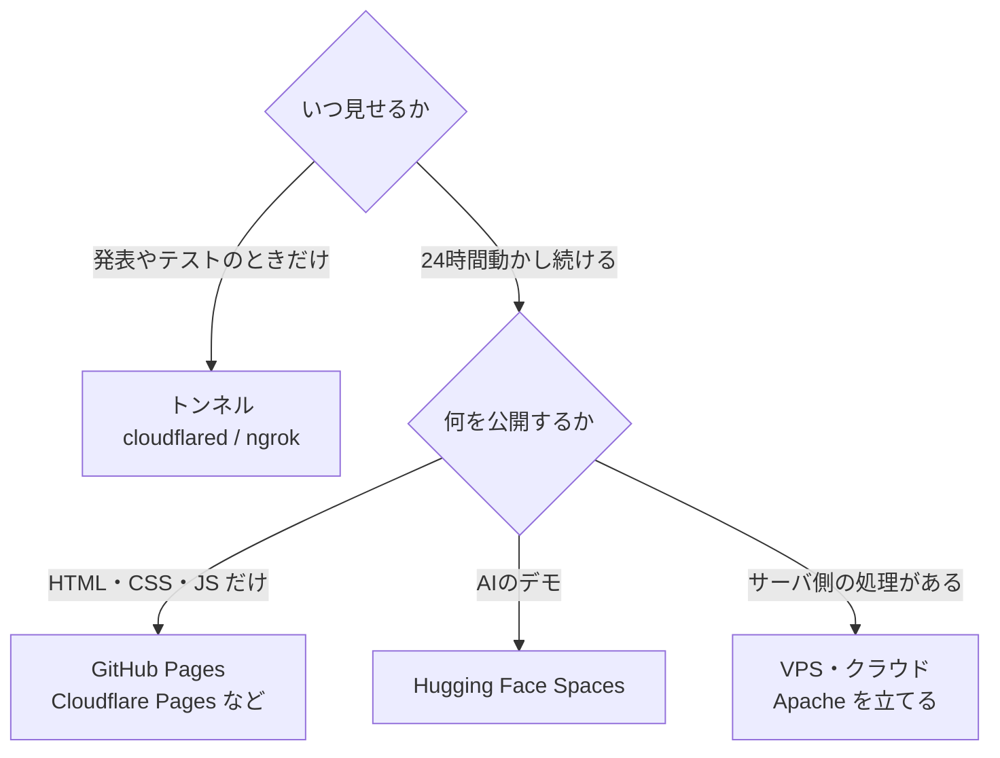
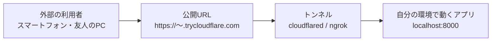

# サーバの構築と公開

借りたサーバに接続し、Webサーバを立てて、作ったものをインターネットに公開するまでを扱います。

## サーバへの接続（SSH）

SSHは、ネットワークを介して別のコンピュータに安全に接続し、遠隔操作するためのプロトコルです。通信経路が暗号化されるため、パスワードやコマンドを盗聴されません。仮想マシンやAWS、GCP、Azureなどのクラウドサービスを利用する場合、SSHを利用して開発するのが一般的です。



### 公開鍵認証のしくみ

SSHの接続では、パスワードの代わりに鍵のペアを使う「公開鍵認証」が広く使われています。公開鍵は接続先のサーバに登録し、秘密鍵は自分の端末だけに置きます。秘密鍵そのものはネットワークに流れないため、盗聴されても悪用されません。



秘密鍵は他人に渡してはいけません。GitHubなどに誤ってアップロードしないよう注意してください。

### AWSの場合

デフォルトでssh接続が可能になっていますが、公開鍵認証を利用する必要があります。

AWSのコンソールから、`EC2 > インスタンス > [インスタンスID] > 接続 > SSH接続`を選ぶと、接続方法が表示されます。


### OpenSSHの使い方

Windowsの`PowerShell`からssh接続を行うことができます。

```bash
ssh -i <秘密鍵のパス> <ユーザ名>@<IPアドレス>
```

`-i`オプションは秘密鍵へのパスを指定するオプションです。`<ユーザ名>`は接続先のユーザ名、`<IPアドレス>`は接続先のIPアドレスを指定します。

例えば、接続先に`ec2-user`というユーザがいて、IPアドレスが`10.11.12.13`で、秘密鍵が`~/.ssh/mykey.pem`にある場合、以下のように接続します。

```bash
ssh -i ~/.ssh/mykey.pem ec2-user@10.11.12.13
```

また、ssh接続を簡単にするために、`~/.ssh/config`に設定を記述することができます。`~`はユーザのホームディレクトリを表します。

```
Host <ホスト名>
  HostName <IPアドレス>
  User <ユーザ名>
  IdentityFile <秘密鍵のパス>
```

### うまくssh接続できない場合

`-v`オプションをつけると、デバッグ情報を表示することができます。接続できなかった理由を確認してみましょう。

### 拡張機能 Remote - SSH のインストール

前に紹介した Visual Studio Code には Remote - SSH という拡張機能があり、あたかもローカルで開発しているかのように、リモートのサーバーに接続して開発することができます。ターミナルで `ssh` コマンドを打つ代わりに、使い慣れたエディタの画面のままサーバ上のファイルを編集できます。

拡張機能をインストールするには、Visual Studio Codeを開いて、左側のアイコンから`拡張機能`を選択し、検索バーに`Remote - SSH`と入力して、拡張機能をインストールします。


[Remote - SSH](https://marketplace.visualstudio.com/items?itemName=ms-vscode-remote.remote-ssh)

インストールが完了したら、Visual Studio Codeを再起動してください。

再起動後、`F1`キーを押してコマンドパレットを開き、`Remote-SSH: Open SSH Host...`を選択します。

表示された入力欄に、`<ユーザ名>@<ホスト名>`または`<ユーザ名>@<IPアドレス>`を入力してエンターキーを押します。パスワードを求められた場合は入力してください。（公開鍵認証を利用することをお勧めします）

接続が完了したら、`ファイル > フォルダを開く`を選択して、リモートのフォルダを開きます。

そうすると、ローカルで開発しているかのように、リモートのサーバー上で開発を行うことができます。

## Webサーバ（Apache）

Apacheは、広く使われているウェブサーバーソフトウェアです。Apacheを使うことで、作成したウェブサイト（HTMLやCSS、JavaScriptなどのファイル）をウェブサーバー上で公開することができます。



### インストール

Ubuntuの場合、以下のコマンドでApacheをインストールできます。

```bash
sudo apt update
sudo apt install apache2
```

### 設定ファイル

#### ドキュメントルート

作成したHTMLファイルはApacheのドキュメントルートに配置する必要があります。通常は`/var/www/html`がドキュメントルートとして設定されています。

#### sites-available/ フォルダ

`/etc/apache2/sites-available/`は、Apacheの設定ファイルが格納されているディレクトリです。

`000-default.conf`は、デフォルトの設定ファイルです。このファイルの中で、ドキュメントルートやポート番号などの設定を行います。

`default-ssl.conf`は、HTTPS（SSL/TLS）を利用する場合の設定ファイルです。ここにSSL証明書のパスやポート番号などを設定します。

### 設定の反映・再起動

設定ファイルを変更した場合、設定の反映とApacheの再起動が必要です。

```bash
sudo a2ensite <設定ファイル名> # 設定の有効化
sudo systemctl reload apache2 # 設定の反映
```

設定ファイルは、`sites-available`（設定を置く場所）に作り、`a2ensite` で `sites-enabled`（実際に使われる場所）へ有効化する、という二段構えになっています。設定を書いただけでは反映されない点に注意してください。



## インターネットへの公開

制作したものを他の人に見せたり試してもらったりするには、インターネットに公開する必要があります。中間発表でデモを見せる、友人にテストしてもらう、といった目的に応じて、手軽な方法から本格的な方法までいくつかの選択肢があります。



計画書の「公開方法」の欄には、この中のどれを使うのかを書きます。

### 一時的に公開する（トンネル）

自分のPC（localhost）で動かしているアプリを、そのまま外部からアクセスできるようにする方法です。手元で動かしたままURLを配れるので、デモやテストに向いています。

外部からの通信は、いったんトンネルの提供元を経由して、自分の環境で動いているアプリに届きます。サーバを借りなくても公開できるのはこのためです。



- ngrok: localhostに公開URLを割り当てる定番ツールです。無料でも固定のURLを1つ使えますが、1回の接続が2時間まで、通信量が月1GBまで、といった制限があります。
- Cloudflare Tunnel（TryCloudflare）: アカウント登録なしに、無料でHTTPSの公開URLを作れます。ngrokの有力な代替です。ポート番号を指定するだけなので、Gradioでも自作のHTTPサーバでも同じように公開できます。

### AIデモを公開する（Python）

Pythonで作ったAIや機械学習のプログラムを、Webページ付きで手軽に公開できるツールがあります。

- Gradio: 数行のコードで入力・出力のあるWeb画面を作れるライブラリです。公開URLの発行までライブラリだけで完結します。処理は自分のPCやColab上で動きます。
- Streamlit / Hugging Face Spaces: Streamlitも同様にPythonでWebアプリを作れるライブラリで、Hugging Face Spacesを使えばGradioやStreamlitのアプリを無料で常時公開できます。

### 本格的に公開する（ホスティング）

常時稼働させて誰でもアクセスできるようにするには、ホスティングサービスを利用します。無料枠のあるサービスも多くあります。

- 静的サイト（HTML/CSS/JS）: GitHub Pages、Cloudflare Pages、Netlify など
- アプリケーション: Render、Railway、Fly.io など
- AIアプリ: Hugging Face Spaces

前述のVPSやクラウド（AWSなど）にApacheを立てて公開する方法も、この「本格的に公開する」に含まれます。

### 公開するときのセキュリティ上の注意

トンネルやGradioの共有URLは、インターネットに直接アプリをさらすことになります。つまり、リンクを知っている人は誰でもアクセスでき、場合によってはプログラムを操作できてしまいます。

- 公開する内容にパスワードや個人情報を含めない
- 必要に応じてログイン認証をかける
- 使い終わったら、公開（トンネル）を必ず停止する

これらを徹底し、意図しない情報漏洩や不正アクセスを防ぎましょう。
