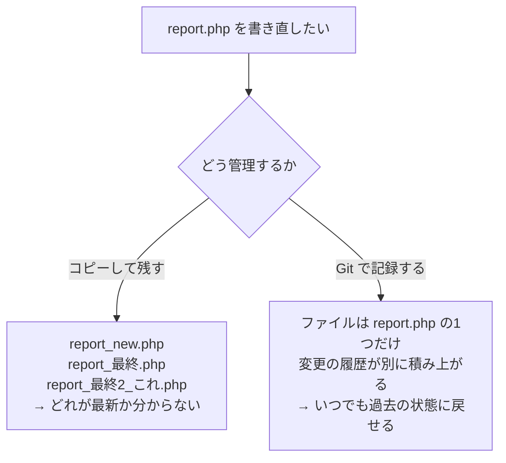
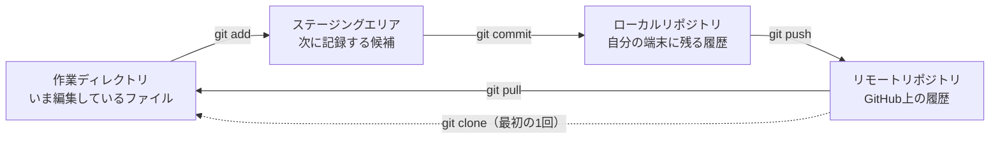
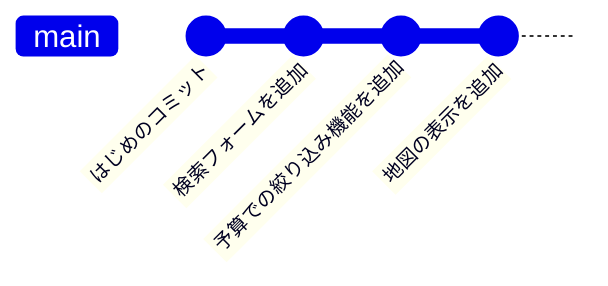
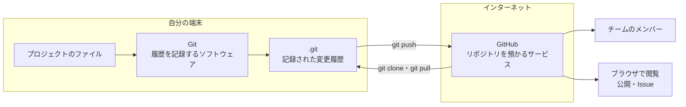
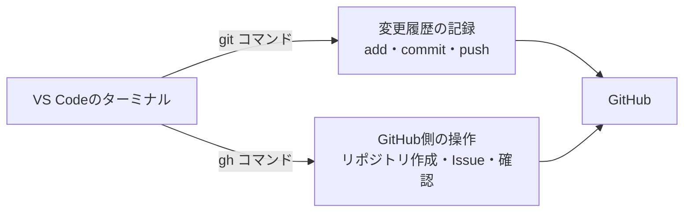
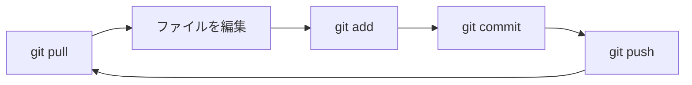
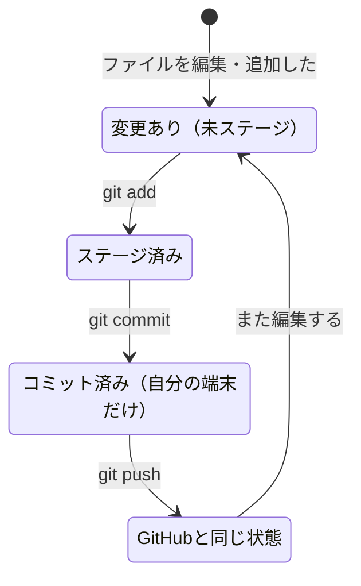
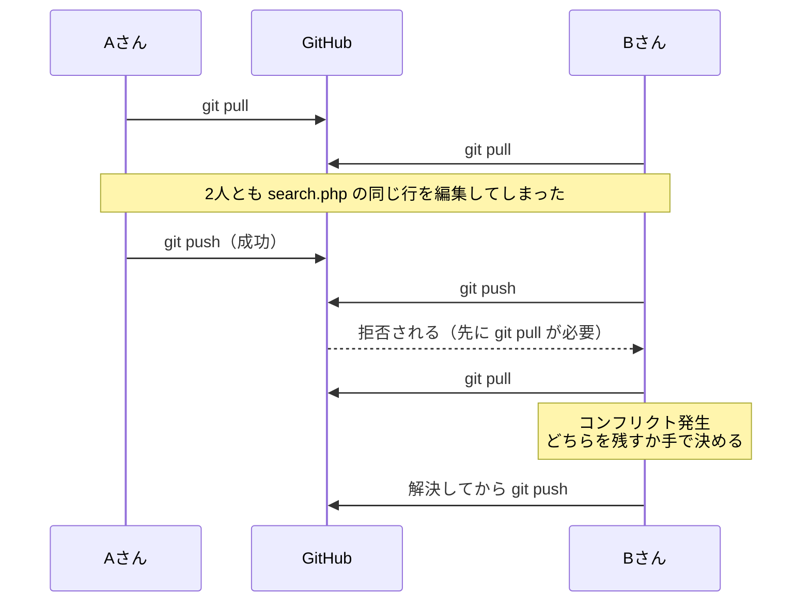
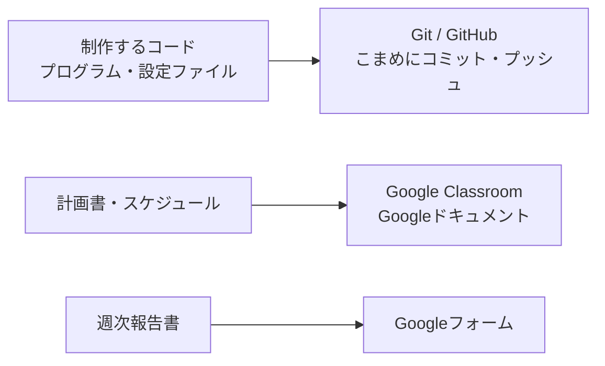

# バージョン管理（Git・GitHub）

プロジェクトを進めると、ソースコードや設定ファイル、計画書や週次報告書など、たくさんのファイルを扱います。誰がどのファイルをいつ変更したかを管理し、必要なら以前の状態に戻せるようにするのが「バージョン管理」です。



Gitは、変更履歴を記録・追跡するための分散型バージョン管理システムです。Linuxカーネルのソースコード管理のためにリーナス・トーバルズによって開発され、現在では多くのソフトウェア開発プロジェクトで採用されています。Gitを使うことで、複数人でのソースコードの共有や、変更履歴の管理が容易になります。

Gitで管理したプロジェクトをGitHubなどにアップロードすれば、自分の制作物を公開でき、ポートフォリオとして実力をアピールすることにもつながります。

Gitのインストール方法は、[Git公式サイト](https://git-scm.com/book/ja/v2/使い始める-Gitのインストール)を参照してください。

## Gitの全体像

Gitでは、ファイルが次の4つの場所を移動していきます。コマンドは、その移動を指示するものです。



- 作業ディレクトリ … ふだん編集しているフォルダそのものです。
- ステージングエリア … 「今回のコミットに含めるファイル」を選んでおく場所です。全部まとめて記録するなら `git add .` を使います。
- ローカルリポジトリ … 自分の端末の中にある履歴です。`git commit` した時点では、まだ自分の端末にしか残っていません。
- リモートリポジトリ … GitHubなど、インターネット上に置く履歴です。`git push` して初めて他のメンバーと共有されます。

## コミットは履歴として積み上がる

`git commit` を実行するたびに、その時点のファイルの状態が1つの区切りとして記録されます。記録は上書きではなく積み上がっていくので、あとから過去のどの時点にも戻れます。



## リポジトリの初期化

既存のプロジェクトを Git で管理し始めるときは、そのプロジェクトのディレクトリに移動して次のコマンドを実行します。

```bash
git init
```

これを実行すると .git という名前の新しいサブディレクトリが作られ、リポジトリに必要なすべてのファイル (Git リポジトリのスケルトン) がその中に格納されます。

この時点ではまだ、プロジェクト内のファイルは管理対象になっていません。管理を始めたいファイルを `git add` で追加し、`git commit` で記録します。

```bash
git add . # 全てのファイルを追加
git commit -m 'はじめのコミット' # コミットメッセージを記述
```

これで、ファイルの変更履歴を記録することができました。ただし、このままでは変更履歴は自分の端末内にしか保存されません。次の手順で、リモートリポジトリ（GitHubなど）にアップロードします。

## GitとGitHubの違い

Gitは自分の端末で動くソフトウェア、GitHubはインターネット上のサービスです。名前が似ていますが、別のものです。



| | Git | GitHub |
| --- | --- | --- |
| 正体 | 端末にインストールするソフトウェア | Webサービス（サイト） |
| 役割 | 変更履歴を記録・管理する | 記録した履歴を預かり、共有・公開する |
| 操作する方法 | `git` コマンド、VS Codeのソース管理 | ブラウザ、`gh` コマンド |
| 単体で使えるか | 使える（1人なら端末内だけで完結する） | 使えない（Gitで記録した履歴を預ける場所） |
| ほかの選択肢 | ー | GitLab、Bitbucket など |

インターネット上でリポジトリを預かるサービスはGitHub以外にもあります。`git push` や `git pull` はGit側のコマンドで、預け先がGitHubでもGitLabでも同じように使えます。

## GitHubアカウントを作成する

GitHub にリポジトリを置くには、GitHub のアカウントが必要です（無料で作成できます）。このアカウントは、このあと紹介する AI コーディング補助（GitHub Copilot）にサインインするときにも使うので、最初に作っておきましょう。

1. [GitHub](https://github.com/) にアクセスし、Sign up からアカウントを登録します。
2. メールアドレス・パスワード・ユーザー名を入力し、案内に従ってメール認証を済ませます。
3. ユーザー名は公開されるので、制作物のポートフォリオとして見せられる名前にしておくとよいでしょう。

学生認証で Copilot Pro を無料化する場合は、学校のメールアドレスで登録しておくと認証がスムーズです。

## GitHubにリポジトリを作成する

アカウントを作成したら、新しいリポジトリを作成します。画面のガイダンスに従ってリポジトリを作成したら、リポジトリのURLをコピーします。

リポジトリのURLには、`https`と`ssh`の2種類があります。この授業では`ssh`を使います。公開鍵をGitHubに登録する必要がありますが、次に紹介する `gh auth login` を実行すれば、鍵の作成と登録はまとめて済ませられます。

先ほど作成したgitプロジェクトを、GitHubにアップロードするために、次のコマンドを実行します。

```bash
git remote add origin <GitHubのリポジトリのURL>
git push -u origin main
```

これで、GitHubにリポジトリが作成され、変更履歴がアップロードされました。

## GitHub CLI（ghコマンド）を使う

`gh` は、GitHubが公式に提供しているコマンドラインツールです。リポジトリの作成やIssueの登録など、これまでブラウザで行っていた操作を、ターミナルから実行できます。



`git` は変更履歴そのものを扱うコマンド、`gh` はGitHub側を操作するコマンドです。

### インストール

PowerShellを開き、次のコマンドを実行します。

```powershell
winget install --id GitHub.cli
```

インストールが終わったらPowerShellを開き直し、`gh --version` でバージョンが表示されれば成功です。

### 認証する

最初の1回だけ、次のコマンドで認証します。

```bash
gh auth login
```

質問に順に答えていきます。

| 質問 | 選ぶもの |
| --- | --- |
| What account do you want to log into? | `GitHub.com` |
| What is your preferred protocol for Git operations? | `SSH` |
| Generate a new SSH key to add to your GitHub account? | `Yes`（鍵がまだない場合） |
| How would you like to authenticate GitHub CLI? | `Login with a web browser` |

最後にブラウザが開き、画面に表示された8桁のコードを入力すると認証が完了します。

この操作で、SSHの鍵ペアの作成と、公開鍵のGitHubへの登録までが自動で行われます。前の「公開鍵認証のしくみ」で説明した仕組みがそのまま使われるので、以降は `git push` のたびにパスワードを入力する必要がありません。

いま誰としてログインしているかは、次のコマンドで確認できます。

```bash
gh auth status
```

### よく使うコマンド

| やりたいこと | ブラウザでの操作 | ghコマンド |
| --- | --- | --- |
| リポジトリを作る | New repository から作成 | `gh repo create <名前> --private --source=. --remote=origin --push` |
| リポジトリを複製する | URLをコピーして `git clone` | `gh repo clone <ユーザ名>/<リポジトリ名>` |
| リポジトリのページを開く | ブックマークから開く | `gh repo view --web` |
| Issue（やること）を登録する | Issues タブから New issue | `gh issue create` |

`gh repo create` の例は、手元にある `git init` 済みのプロジェクトをGitHubに非公開リポジトリとして作成し、`origin` として登録したうえで `push` までを一度に行います。前の「GitHubにリポジトリを作成する」でブラウザから行った作業を、1つのコマンドで済ませられます。誰でも見られる公開リポジトリにする場合は、`--private` を `--public` に変えてください。

## リモートリポジトリからプロジェクトをダウンロードする

```bash
git clone <GitHubのリポジトリのURL>
```

## リモートリポジトリの変更履歴を取得する

```bash
git pull origin main
```

## 普段の作業の流れ

一度リポジトリを用意したら、あとは次のサイクルを毎回くり返します。

1. `git pull` — 作業を始める前に、最新の状態を取り込む（他のメンバーの変更を反映する）
2. ファイルを編集する（コードを書く、計画書や週報を更新する など）
3. `git add` — 変更したファイルを、記録する対象に加える
4. `git commit` — 変更に説明文（メッセージ）をつけて記録する
5. `git push` — 記録をGitHubにアップロードして共有する



毎日の作業は、次の3つのコマンドを覚えれば回ります。

```bash
git add .                        # 変更したファイルをすべて対象に加える
git commit -m "予算での絞り込み機能を追加"   # 変更を記録する（メッセージは具体的に）
git push                         # GitHubにアップロードする
```

> コミットメッセージは「何をしたか」が分かるように具体的に書きます。「修正」より「予算での絞り込み機能を追加」のように書きましょう。

## VSCodeで操作する

コマンドに慣れないうちは、上で紹介した VSCode の「ソース管理」パネルから、ボタン操作でも同じことができます。

1. 左のアイコンから「ソース管理」を開く（変更したファイルが一覧に出る）
2. ファイルの横の ＋ を押して、記録する対象に加える（＝ `git add`）
3. 上の入力欄にメッセージを書いて、コミットを押す（＝ `git commit`）
4. 変更の同期（↑↓のアイコン）を押す（＝ `git push` / `git pull`）

## いまの状態を確認する

「どのファイルを変更したか」「まだ記録していないファイルはどれか」を確認するには次を使います。

```bash
git status
```

`git status` は、1つ1つのファイルが次のどの状態にあるかを表示します。



| 状態 | `git status` の表示 | 次にすること |
| --- | --- | --- |
| 変更あり（未ステージ） | 赤字で `modified:` や `Untracked files` | `git add` |
| ステージ済み | 緑字で `Changes to be committed:` | `git commit` |
| コミット済み | `Your branch is ahead of 'origin/main'` | `git push` |
| GitHubと同じ状態 | `nothing to commit, working tree clean` | 次の編集へ |

## チームで使うときの注意

複数人が同じファイルを同時に編集すると、変更がぶつかる「コンフリクト」が起きて、解決が大変になります。コンフリクトは、次のような流れで起こります。



慣れるまでは、次を守るとトラブルを減らせます。

- 担当を分けて別々のファイルを触る（例: ページごとに `search.php`／`detail.php` のように分担する）
- 作業を始める前に必ず `git pull`、区切りがついたら早めに `git commit` と `git push`
- 一度にたくさん変更せず、こまめにコミットする

## この授業での使い方

この授業で git を使うのは、制作するコード（プログラム）の管理です。こまめにコミット・プッシュしておけば、コミットの履歴がそのまま作業の記録になり、動かなくなったときも前の状態に戻せます。

なお、計画書・スケジュールは Google Classroom（Google ドキュメント）、週次報告書は Google フォームで提出します。書類の提出に git は使いません。


