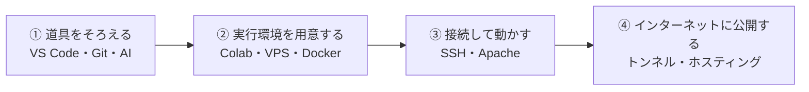
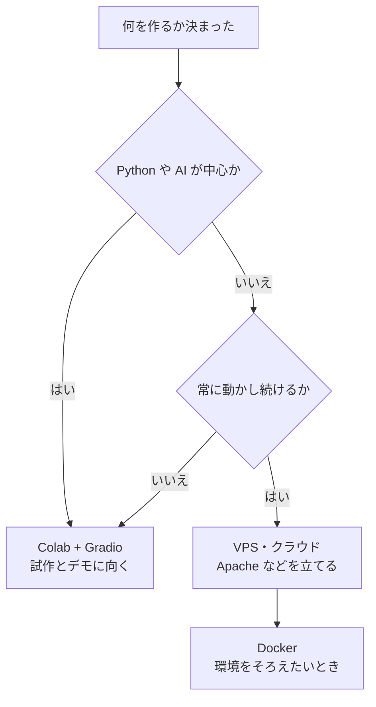
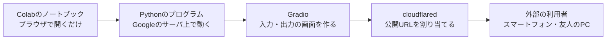
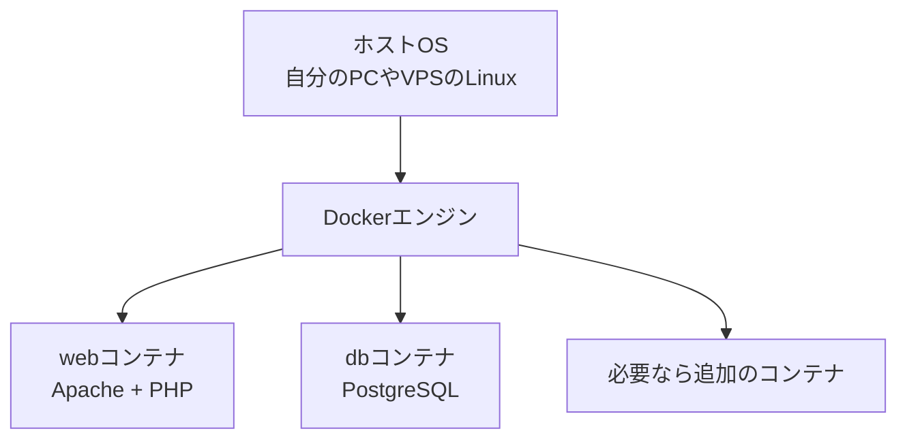
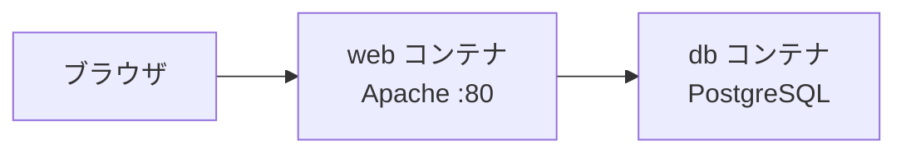
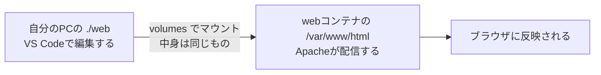

# 開発環境

Webサーバやデータベースなどのソフトウェアを動かす環境を用意し、その上でプログラムを開発します。

まず開発に使う道具としてエディタ・バージョン管理・AIをそろえ、次にどこで動かすかを決めて実行環境を用意します。続いてサーバへの接続とWebサーバを扱い、最後に完成したものをインターネットに公開するところまで進みます。

git を使うのは、制作するコードの管理です。計画書・スケジュール・週次報告書などの書類は、Google Classroom で配布・提出します。



## 統合開発環境（VS Code）

制作の過程でプログラミングを行う場合、統合開発環境（IDE）を利用すると便利です。

IDEは、プログラムの作成、実行などの作業を一つのソフトウェアで行うことができます。

IDEにはいくつかの種類がありますが、ここでは広く使われている[Visual Studio Code](https://code.visualstudio.com/)を使います。

Visual Studio Codeは、Microsoftが提供しているオープンソースのIDEで、多くのプログラミング言語に対応しています。

以降で説明するバージョン管理（Git）やAIによるコーディング補助も、このエディタの中から使えます。

## 実行環境を用意する

作ったプログラムを動かす場所（実行環境）を用意します。大きく分けて、Colab で手軽に始める方法と、VPS やクラウドにサーバを用意する本格的な方法があります。



### Colab + Gradio + cloudflared

Google Colab を使えば、環境構築をほとんどせずに、開発から公開までをブラウザだけで完結できます。Python や AI を使った制作に向いています。



Colab 上で Gradio を使って操作画面を作り、cloudflared で公開 URL を割り当てれば、VPS や SSH を用意しなくても作るところから公開するところまで進められます。まずはこの方法で試作し、常に動かし続ける本番環境が必要になったら、このあとで紹介するサーバ（VPS）を使う方法に進むとよいでしょう。

使い方は、Colab のノートブックにまとめてあります。Gradio の入力・出力に使える部品の一覧、`http.server` で自分で HTTP サーバを立てる方法、公開 URL の発行方法が載っています。手元で動かしながら確認してください。

[Colabでノートブックを開く](https://colab.research.google.com/github/mitsuya3471/thesis/blob/main/notebooks/gradio-cloudflared.ipynb)

なお、公開 URL は誰でもアクセスできます。最後の「インターネットへの公開」にある、認証をかける、使い終わったら止める、といった注意も必ず確認してください。

### VPS・クラウド

グローバルIPアドレスを持つサーバを借りて、VPSやクラウド上で開発する方法もあります。

VPSとは、Virtual Private Serverの略で、物理サーバー上で動作する仮想サーバを借りることができるサービスです。

- [さくらのVPS](https://vps.sakura.ad.jp/)
- [AWS Lightsail](https://aws.amazon.com/jp/lightsail-vps/)

クラウドとは、インターネット上にあるサーバやストレージなどのコンピュータリソースを、必要なときに必要なだけ利用することができるサービスです。

- [さくらのクラウド](https://cloud.sakura.ad.jp/specification/server-disk/#server-disk-content01)
- [Google Compute Engine](https://cloud.google.com/compute?hl=ja)（e2-micro インスタンス）を 1 か月あたり 1 台無料で利用できます。
- [Amazon EC2](https://aws.amazon.com/jp/ec2/)

どちらもよく似たサービスですが、VPSのほうが比較的安価ですむことが多いです。

Google CloudやAWSでは、一定期間使用できる無料枠がありますので、そちらを利用するのも良いでしょう。

### Dockerコンテナ

Dockerコンテナを使用する方法です。

Dockerとは、Linux上で動作するコンテナ型の仮想化ソフトウェアです。

Dockerコンテナは、小さなLinuxカーネルを持ち、その上で動作するアプリケーションを実行することができます。

1台のコンピュータの上に、用途ごとの小さな実行環境をいくつも並べて動かすイメージです。



近年ではスタートアップ企業や、ベンチャーをはじめとする多くの企業で、Dockerコンテナが使われています。

Dockerのインストール方法は、[Docker公式サイト](https://docs.docker.com/engine/install/ubuntu/)を参照してください。

こちらの方法では、後述のdocker-composeを作成し、gitで管理することで、ほかの端末でも容易に同じ環境を構築することができます。ただし、ほかの端末にもdockerをインストールする必要があります。

### docker-compose

docker-composeは、複数のDockerコンテナを一括で管理するためのツールです。

たとえば、制作物にWebサーバとデータベースが必要な場合、次のように記述することで、Webサーバとデータベースを一括で管理することができます。



WebサーバとしてApache、データベースとしてPostgreSQLを使用する場合の`docker-compose.yaml`ファイルは次のようになります。

```yaml
services:
  web:
    image: php:8.3-apache
    ports:
      - "80:80"
    volumes:
      - ./web:/var/www/html
  db:
    image: postgres:17
    container_name: seisaku-db
    hostname: seisaku-db
    volumes:
      - seisaku-postgres:/var/lib/postgresql/data
    environment:
      - POSTGRES_PASSWORD=postgres
      - TZ=Asia/Tokyo

volumes:
  seisaku-postgres:
```

#### 設定項目の意味

| 設定項目 | 役割 |
| --- | --- |
| `services` | 起動するコンテナの一覧。この例では `web` と `db` の2つ |
| `image` | 使用するDockerイメージ。`php:8.3-apache` はApacheにPHPを組み込んだ公式イメージ（Apacheだけでよければ `httpd:2.4`） |
| `ports` | `"ホストOSのポート:コンテナのポート"`。`"80:80"` とすると、ブラウザから `http://サーバのIP/` でアクセスできる |
| `volumes` | ホストOSのディレクトリを、コンテナ内のディレクトリにマウントする |
| `environment` | コンテナに渡す環境変数。データベースのパスワードやタイムゾーンを指定する |

#### 起動する

`docker-compose.yaml` を配置したディレクトリで次のコマンドを実行すると、Webサーバとデータベースがまとめて起動します。

```bash
$ docker compose up
```

#### ファイルの共有（volumes）

この構成では、`volumes` によってホストOSの `./web` ディレクトリを、コンテナ内の `/var/www/html` ディレクトリにマウントしています。2つは同じ中身を指すので、手元で編集した結果がそのままWebサーバに反映されます。



`./web` には、HTMLやPHPなど、Webサーバが配信するファイルを置きます。VS Codeで編集して保存すれば、ブラウザを再読み込みするだけで結果を確認できます。

`db` コンテナのPostgreSQLに接続するには、`docker exec -it seisaku-db psql -U postgres` を実行します。

`docker-compose.yaml` を、プロジェクトのファイルと一緒にgitで管理しておくと、ほかの端末でも `docker compose up` だけで同じ環境を再現できます（各端末にDockerをインストールしておく必要はあります）。
